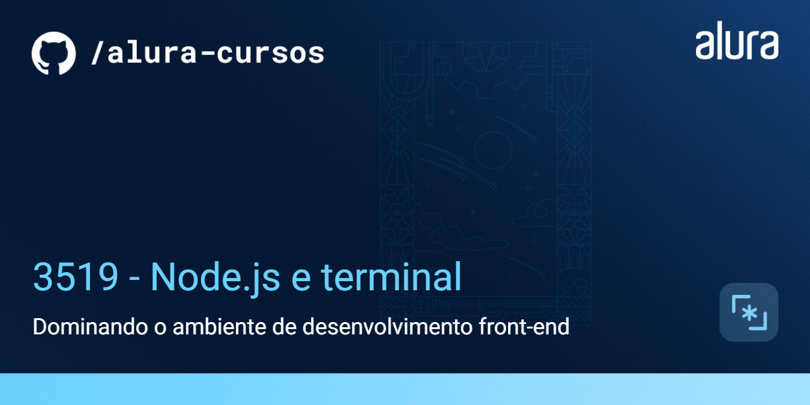
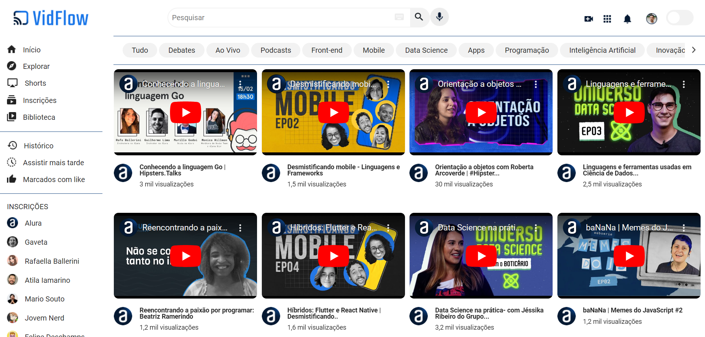

# VidFlow

O VidFlow é uma plataforma de compartilhamento de vídeos.



## 🔨 Funcionalidades do projeto

Atualmente, o visual do projeto e sua funcionalidade de buscar em uma API pelas informações dos vídeos já estão prontos.

Agora, o time de desenvolvimento do VidFlow decidiu aplicar o uso de novas ferramentas que irão melhorar a qualidade do código do projeto, como o ESLint, Prettier, Axios e o Vite.

Para isso, aprenderemos a utilizar o **Node.js**, necessário para aplicar todas essas ferramentas.

## ✔️ Técnicas e tecnologias utilizadas

- Node.js
- NPM
- Os pacotes ESLint, Prettier, JSON Server, Axios e Vite
- Vercel

# Acesso ao Projeto

[Acesse o projeto publicado na Vercel](https://nodejs-vidflow-vite-gilt.vercel.app/).

## Link do Figma

[Acesse o Figma do Vidflow](https://www.figma.com/file/a0crwitCtGmNIQW0RVIs5H/VidFlow-%7C-Curso-Js---Consumindo-dados-de-uma-API?node-id=0%3A1&mode=dev).

## 🛠️ Abrir e rodar o projeto

Para rodar esse projeto, você precisa ter o [Node.js](https://nodejs.org/) instalado.

Após baixar ou clonar este repositório, rode o seguinte comando para instalar as dependências do projeto:

```bash
npm install
```

Em seguida, disponibilize a API local de vídeos:

```bash
npm run api-local
```

Por fim, disponibilize o servidor de desenvolvimento do Vite:

```bash
npm run dev
```

E você conseguirá acessar o projeto em `http://localhost:5173/` no navegador.
